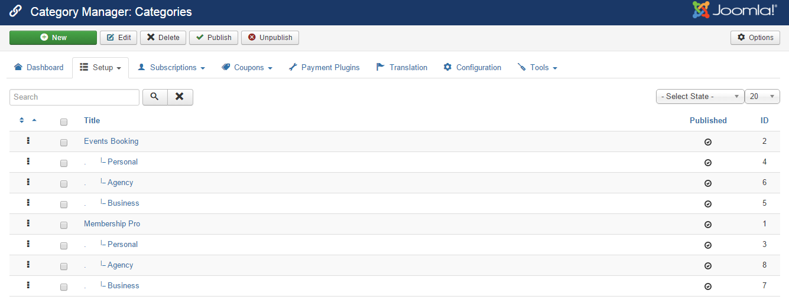
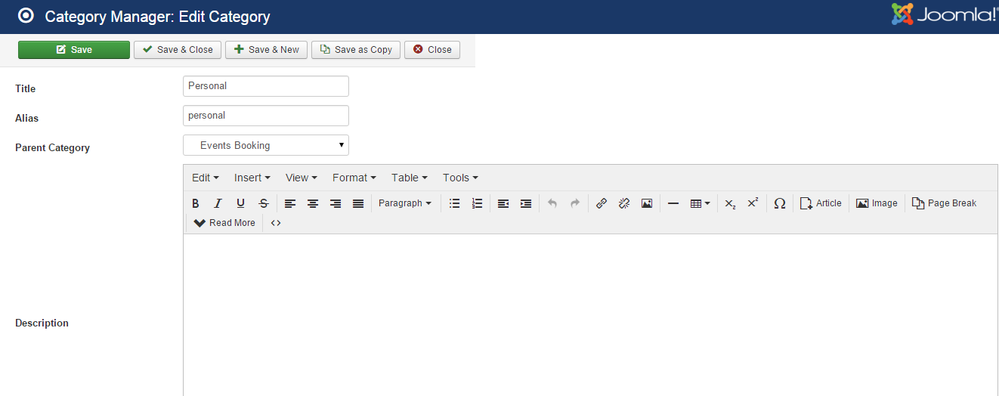

**Membership Pro** allows you to organize your subscription plans cross infinite categories and subcategories (nested categories). 

However, please note that **categories is completely optional and in most cases, you won't have to setup categories**. You will only have to create categories if your site has many subscritpion plans and need to categorize them. Otherwise, simply ignore this step.

To access to categories management page, there are 3 different ways:

1. Access to **Membership Pro -> Categoires**
2. Access to Membership Pro Dashboard, then click on Categories icon
3. On any pages in Membership Pro, access to **Setup => Categories**

## Add new category
Press **New** button in the toolbar to create new category. A form will be displayed to allow you to enter information of the category:

<table class="table table-stripped table-bordered table-considered">
<thead>
<tr><th width="15%">Property</th><th>Description</th></tr>
</thead>
<tbody>
<tr>
<td><strong>Name</strong></td>
<td>Name (title) of the category. The name will be displayed to end-users.</td>
</tr>
<tr>
<td><strong>Alias</strong></td>
<td>Alias will be used to generate the URL link to the category (and plans belong to that category). If you unsure what to enter, simply leaves it empty and the system will generate the alias based on the name of category.</td>
</tr>
<tr>
<td><strong>Parent</strong></td>
<td>Select parent of this category. Set it to <strong>Select Category</strong> and it will become top level category.</td>
</tr>
<tr>
<td><strong> Access</strong></td>
<td>Choose the access level which you want to be able to to access to this category (usually Public). By choosing an access level, only users has this access level can access/see the category.</td>
</tr>
<tr>
<td><strong>Description</strong></td>
<td>Description of the category. Category description will be used to display on categories list page.</td>
</tr>
</tbody>
</table>