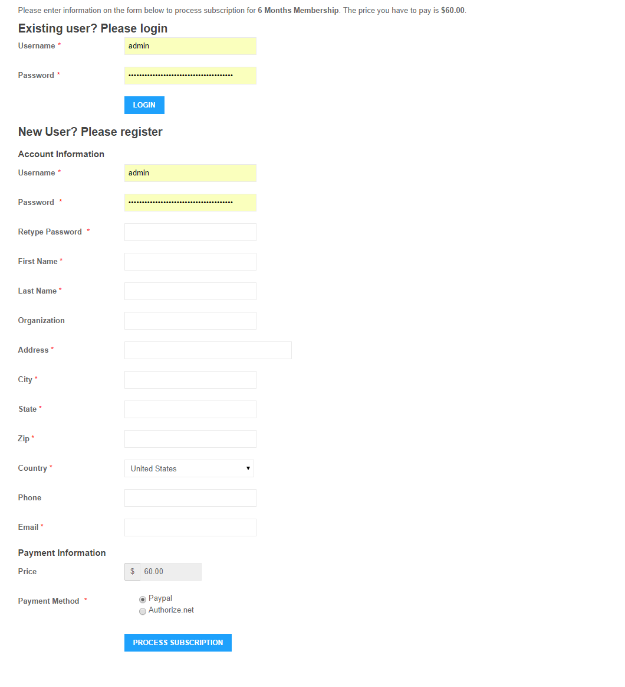

When users click on **Sign up** button to subscribe for a subscription plan, **Membership Pro** will display a form so that they can enter their information for the subscription (Username, Password, Email, First Name, Last Name, Organization, Address...). The subscription form in Membership Pro is fully customizable

1. **Allow user registration**: If you want to allow your subscribers to enter username and password to register for an account on your website when they sign up for your subscription plan, you can go to **Membership Pro -> Configuration**, find the config option **Registration Integration**, set it to **Yes**.
2. **Show Login Box**: If you want to users who have existing account on your site to be able to login before continue their subscription process (so that the subscription record will be assigned to his account), you can go to **Membership Pro -> Configuration**, find the config option **Show login box on subscription page**, set it to **Yes** (this should be set to Yes if you allow users registration)
3. **Show/Hide, Require/Not require form fields**: If you want to make a field on subscription form to be showed/hided or required/not required, please go to Membership Pro -> Custom Fields, publish/unpublish or mark it as required/not required.
4. **Change title of the custom fields**: Sometime, you might want to change title of the custom field (for example, change it from Organization to Company). In this case, just go to **Membership Pro -> Custom Fields**, click on the custom field you want to change and edit it, change the title to meet your need.
5. **Add more custom fields to subscription form**: When you first install Membership Pro, the extension auto generate a list of pre-defined custom fields which we call Core Fields. They are **First Name, Last name**......If you want to collect more information of subscribers, you can go to **Membership Pro -> Custom Fields** and create any extra custom fields you want. With custom fee field feature, you can even config it so that the subscription price will be changed based on what options users choose on registration form.
