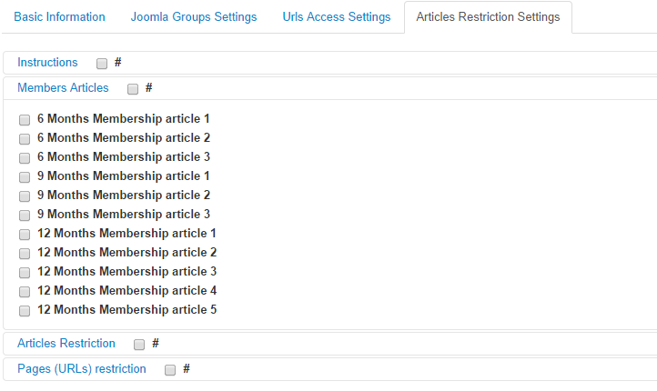
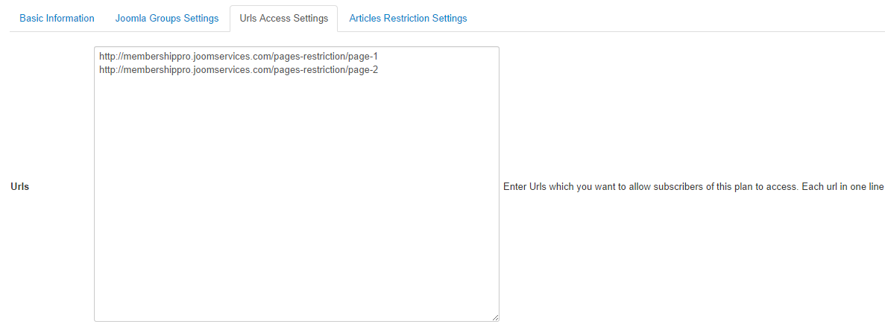

When users sign up for your subscription plans, you usually want to give them access to restricted resources on your site (Joomla menu items, Joomla modules, Joomla articles, K2 items, Files/Documents, Videos...). Of course, these resources won't be available to public visitors and normal Joomla registered users. Membership Pro has different ways to allow you to restrict access to these resources as explained below:

## Using Joomla core ACL

Every Joomla item (espcially items from Joomla core) such as **Menu Items**, **Modules**, **Categories**, **Articles**, **EDocman Documents**.... has a field called **Access** to control who (users from what groups) can access/ view that item.  Base on that basic principle, we can setup Membership Pro so that only subscribers from the subscription plan(s) can access to these items (but public members and normal registered users cannot). The steps are:

1. Create a new Joomla Group called **Subscribers**
2. Create a new access level called **Subscribers**, then choose **Subscribers** group for this access level.
3. Follow the instructions at [Joomla Groups integration](../joomla-groups-integration) to assign subscribers of the plan to **Subscribers** group
4. Edit the item (modules, menu items, articles...) you want to restrict access to subscribers from this memebership plan, set access property of that menu item to **Subscribers** access level (the access level which you created in step #2)

By doing that, when users sign up for this subscription plan, they will be assigned to **Subscribers** group, thus has **Subscribers access level** and can access/see the items which you restricted. After their subscription expired, they **will be removed from Subscribers group** and **lost the Subscribers access level**, so they could not access/see these items anymore. As you can see, we can assign subscribers from different Joomla groups, so you can give them access to different restricted resources based on the plans they sign up. Hope you get the idea and can setup it to meet your need :).

## Restrict access to part of Joomla articles
This method can be used if you want to **show intro text** of a Joomla article and only allow subscribers from certain subscription plans read the full article. You can see an example on our demo site at http://membershippro.joomservices.com/articles-restriction/9-months-membership-article-restriction . Basically, when a user access to the article:

1. If he has an active subscription of a plan which is allowed to access to the article, he can read the full article.
2. If he doesn't have an active subscription of the plan, he will just show a small part of the article. The remaining part of the article (admin can decide which part he want to hide) will be hided and a message will display to users ask them to sign up for the plans if they want to access to the full article.

To restrict access to articles using this method, you can use the Content - Membership Pro Content Restriction plugin in Membership Pro. The steps are:

1. Go to Extensions -> Plugins Manager, find and publish the plugin **Content - Membership Pro Content Restriction**
2. Use this syntax **{mprestriction ids="1"}**_The text you want to hide must be inserted between here_**{/mprestriction}** to restrict access to the article to subscribers of the plan you want. Below is the explanation of the syntax:
* ids="1" mean only users have active subscription of Plan with ID = 1 can see the text. You can change 1 to ID of any plans you want
* You can allow subscribers from different subscription plans to see this text, just separate the plan ids by comma. For example, If you enter ids="1,3" for example, subscribers from plan with ID = 1 or ID = 3 will be able to see the text and so on....

## Restrict access to whole Joomla article (articles detail page)

This method can be used if you want to have a page which display list of articles (for example this page http://membershippro.joomservices.com/articles-restriction, only intro text of the articles are showed). When users click on the link to read the full article:

1. If he has an active subscription of the plan which is allowed to access to the article, they will be allowed to access to article detail page to read the full article
2. If he doesn't have an active subscription of the plan which is allowed to access to the article, he will be redirected to the plans list page with a message ask him to sign up for the needed plans if he want to access to the article. You can access to this link http://membershippro.joomservices.com/pages-restriction/page-1 to understand how it works

To use this method, please follow the instructions below:

1. Go to Extensions -> Plugins Manager, make sure you publish the two plugins : **OS Membership - Articles restriction settings** and **OS Membership Articles Restriction**
2. Now, edit the subscription plan, you will see a new tab called **Articles Restriction Settings**. This tab displayes all articles on your site grouped by categores
3. Check on the checkbox next to the articles which you want subscribers of this plan can access to.

## Restrict access to any pages (urls)
If you have a generic resources (which you know urls) and cannot be restricted by the three mentioned methods (for example, link to a page has video displayed, link to a list of members in Jomsocial, link to access to forum....), you can use the **OS Membership URLs Restriction** plugin to restrict access to these urls. With this method, any pages on your site (which is generated by Joomla - not a static links such as link to a video file on your server) can be restricted to subscribers. This can be used in case:

1. You want to create menu items to link to these resouces. Users will see these menu items. However, when they click on the menu item to access to the resources, if they don't have an active subscription, they will be be redirected to Plans list page which ask them to subscribe before they can access to the page/menu item. See Page Restriction sub menu items on our demo sitte http://membershippro.joomservices.com/ to understand how it works.
2. Maybe you will have a page which display list of resources and each resource has a link to access to it (for example, a category page which display list of videos...). When users click on the link to view detail of the resouce (the video detail page for example), if they don't have an active subscription, they will be be redirected to Plans list page which ask them to subscribe before they can access to the resource

To use this method, please follow the steps below:

1. Go to **Extensions -> Plugins Manager**, make sure you publish the two plugins **OS Membership URLs Restriction**, **OS Membership - Urls Restriction Settings**
2. Now, edit the plan, you will see a new tab called **URLs Access settings**
3. Enter the urls you want to restrict access to subscribers of that plan into the textarea in the URLs Access settings tab. Please note:
* Each url must be entered on one line
* Please **DON'T ENTER www** in these urls

